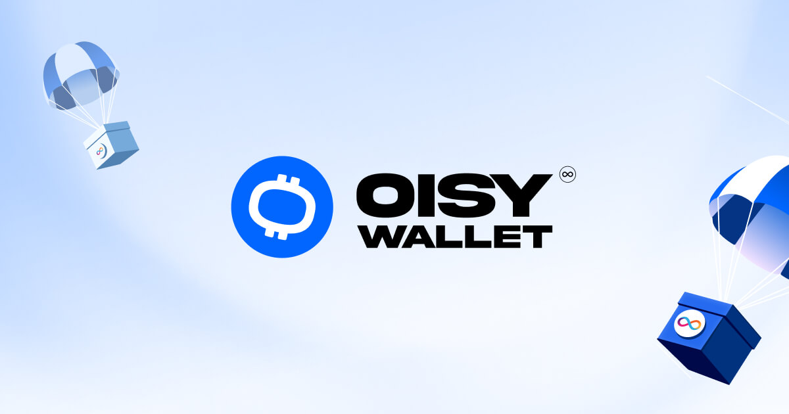

<div style="display:flex;flex-direction:column;">
  <a href="https://oisy.com/">
    
  </a>

<br/>
<br/>

[](https://internetcomputer.org)
[](https://github.com/dfinity/oisy-wallet/actions/workflows/backend-tests.yml)
[](https://github.com/dfinity/oisy-wallet/actions/workflows/frontend-checks.yml)

</div>

---

## What is the OISY wallet

OISY is a new browser-based, network-custodial and multi-chain wallet powered by Internet Computer's [chain fusion](https://internetcomputer.org/chainfusion) technology.

## Features

The OISY wallet provides a convenient user experience known from custodial wallets but without their strong trust assumptions. In contrast, OISY provides trust assumptions based on network custody, and comparable to self-custody. Different from self-custody wallets though, OISY requires no browser extensions or additional mobile app, a standard off-the-shelf web browser is sufficient. In conclusion, OISY provides an attractive user experience with a low entry barrier, yet requires no strong trust assumptions.

Building on ICP, OISY achieves a unique set of features:

- **Browser-based:** no matter your browser and operating system preferences, OISY allows you to receive, hold, and send native ICP, ICRC-1, ETH, ERC20 (and in the near future BTC).

- **Cross-device:** due to the use of Internet Identity, OISY can easily be used across all devices you have linked to your Internet Identity.

- **Network custody:** the key controlling your multi-chain assets is not controlled by a single entity nor has it ever existed as such. The key was generated using advanced cryptography that distributed key-shares among dedicated ICP replica nodes and signatures are created using [threshold ECDSA](https://internetcomputer.org/docs/current/developer-docs/integrations/t-ecdsa/).

- **Fully on-chain:** not only the keys but the entire wallet application is stored on-chain and served directly to your browser. The entire wallet is secured by a decentralized trust model, which guarantees that neither the front-end, nor the back-end have been tampered with.

- **Interoperable:** OISY integrates with the [WalletConnect](https://walletconnect.com/) protocol allowing you to use it as a wallet for many established web3 services, such as Uniswap. The OISY team is actively working on integrating OISY with [ICP's signer standards](https://github.com/dfinity/wg-identity-authentication/blob/main/topics/signer_standards_overview.md) allowing OISY to interact with [ICP's rich dapp ecosystem](https://internetcomputer.org/ecosystem).

- **Free to use and develop:** OISY is open-source software and licensed under [Apache 2.0](LICENSE). Feel free to fork it or propose improvements.

## ICP building blocks used

What are the unique ICP technical building blocks enabling the creation of OISY?

- **Chain-key signatures:** the world's best threshold ECDSA signature [protocol suite](https://eprint.iacr.org/2022/506) (only available on ICP) enables smart contracts to perform cryptographic signatures without a single entity having full access to the private key. Read more about [chain-key cryptography](https://internetcomputer.org/how-it-works/chain-key-technology/) or start building based on [chain-key signature sample code](https://github.com/dfinity/examples/tree/master/rust/threshold-ecdsa).

- **Internet Identity (II):** based on ICP's threshold BLS signature schemes and WebAuthn, Internet Identity (II) is an authentication and key management system with strong privacy and security guarantees. Using [WebAuthn](https://www.w3.org/TR/webauthn-3), users can conveniently create secure sessions with their fingerprint or other biometric identifiers. Read more about [Internet Identity technology](https://internetcomputer.org/internet-identity) or [start integrating II](https://internetcomputer.org/docs/current/developer-docs/integrations/internet-identity/integrate-identity) into your canister smart contract.

- **Web applications served from chain:** ICP is not only designed to run _backends_, such as ledgers, on chain, its low storage cost and low latency allow it to serve _frontends_, such as HTML files and images, from chain, too. Read more about [smart contracts serving web applications](https://internetcomputer.org/how-it-works/smart-contracts-serve-the-web/) or directly start [building your first decentralized web frontend](https://internetcomputer.org/docs/current/developer-docs/frontend/).

- (Upcoming) **HTTP outcalls:** for now, OISY calls centralized Ethereum endpoints, such as Infura or Alchemy, from the frontend. In the future, OISY might be improved to use [HTTP outcalls](https://internetcomputer.org/https-outcalls) to call these endpoints in a decentralized fashion. Check out the [HTTP outcalls sample code](https://internetcomputer.org/docs/current/developer-docs/integrations/https-outcalls/https-outcalls-how-to-use) to explore how to use Web 2.0 services on ICP.

## Submit your dApp

To file a request to have your dApp listed in the dApps explorer of OISY Wallet, please submit this [dApp Submission Request](https://github.com/dfinity/oisy-wallet/issues/new?assignees=&labels=&projects=&template=dapp_submission_request.md&title=Request+a+dApp+to+be+listed+on+the+OISY+Wallet+dApp+Explorer).

## Status

The platform, its software and all content found on it are provided on an “as is” and “as available” basis.
OISY Wallet does not give any warranties, whether express or implied, as to the suitability or usability of the application, its software or any of its content.

## Build and run yourself

### Prerequisites

- [x] Install the [IC SDK](https://internetcomputer.org/docs/current/developer-docs/setup/install/index.mdx).

### Start the local replica

Open a new terminal window _in the project directory_, and run the following command to start the local replica. The replica will not start unless [dfx.json](dfx.json) exists in the current directory.

```
dfx start --background
```

When you're done with development, or you're switching to a different dfx project, running

```
dfx stop
```

from the project directory will stop the local replica.

### Run OISY locally

Make sure you switch back to the project root directory.

First, install the frontend dependencies by running

```
npm ci
```

To build and deploy the project locally, first create a `.env.development` file by copying the [.env.example](.env.example) file. Once you've correctly set the api keys for all the different services that OISY needs, then run:

```
npm run deploy
```

It should output something like the following

```
...
Deployed canisters.
URLs:
  Frontend canister via browser
    frontend: http://127.0.0.1:4943/?canisterId=br5f7-7uaaa-aaaaa-qaaca-cai
  Backend canister via Candid interface:
    backend: http://127.0.0.1:4943/?canisterId=bd3sg-teaaa-aaaaa-qaaba-cai&id=bkyz2-fmaaa-aaaaa-qaaaq-cai
    internet_identity: http://127.0.0.1:4943/?canisterId=bd3sg-teaaa-aaaaa-qaaba-cai&id=be2us-64aaa-aaaaa-qaabq-cai
```

Click on the **frontend** URL to access the OISY Wallet that is running locally.

### Local development

See [HACKING](HACKING.md)

#### Backend

The backend is written in Rust and you can find it under the [backend folder](./src/backend/). It uses the [tECDSA API](https://internetcomputer.org/docs/current/developer-docs/integrations/t-ecdsa/t-ecdsa-how-it-works) provided by IC. To find out more about tECDSA, you can read the [Eurocrypt 2022 paper](https://eprint.iacr.org/2021/1330.pdf).

If you want to locally deploy the backend only, you use the following command

```
dfx deploy backend
```

### Frontend

The frontend is written entirely in Svelte. You can serve the frontend in development mode like you normally develop a svelte app using the command

```
npm run dev
```

## Dependencies

[//]: # 'TODO: Add fonts that are bought and owned by DFINITY too.'

### [Iconly Pro](https://iconly.pro/)

Some Iconly icons are used in the project, **not included**. You must obtain a license separately.  
The license for this project is bought and owned by the DFINITY Foundation, please see terms and conditions [here](https://iconly.pro/pages/terms).
