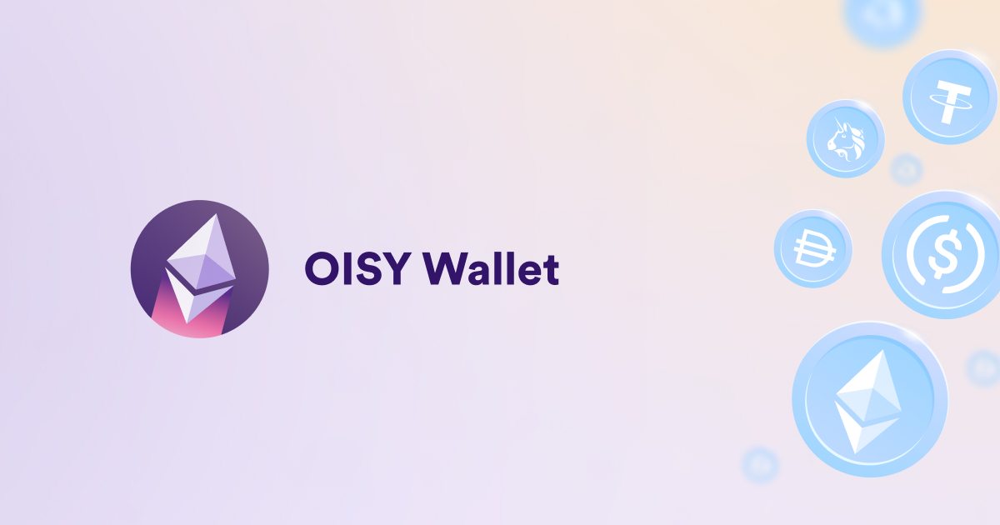
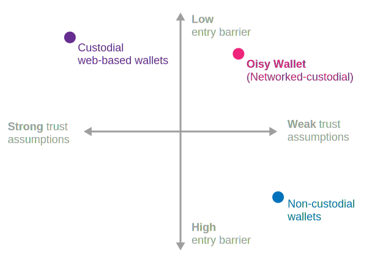

<div align="center" style="display:flex;flex-direction:column;">
  <h1>Oisy Wallet</h1>

  <a href="https://oisy.com/">
    
  </a>

<br/>
<br/>

[](https://github.com/dfinity/oisy-wallet/actions/workflows/build.yml)
<a href="https://github.com/dfinity/oisy-wallet/releases"></a>
[](https://discord.gg/E9FxceAg2j)

</div>

## What is the Oisy Wallet

The Oisy Wallet is a technology demonstrator that shows how one can build a multichain wallet using Internet Computer Protocol (ICP) technology. For now, it demonstrates how to manage Ethereum and ERC20 assets, but its architecture and the underlying ICP technology is extendable to to many other tokens including [Bitcoin](https://internetcomputer.org/bitcoin-integration) and [IC-native tokens](https://internetcomputer.org/docs/current/developer-docs/integrations/icrc-1/deploy-new-token). The name _OISy Wallet_ derives from _Open Internet Service Wallet_.

We invite you to take Oisy for a test drive at [oisy.com](https://oisy.com), explore the code in this repository, and the underlying ICP chain-key technology. At this point, the project is still work in progress and it is not yet recommended to manage assets of significant value, see the [disclaimer below](#status).

## Features

The Oisy Wallet provides a convenient user experience known from custodial wallets but without their strong trust assumptions. In contrast to the latter, Oisy provides trust assumptions comparable to self-custody solutions. Different to self-custody wallets though, Oisy requires no browser extensions or additional mobile app, a standard off-the-shelf web browser is sufficient. In conclusion, Oisy provides an attractive user experience, i.e., a low entry barrier, yet requires no strong trust assumptions.

<div align="center" style="display:flex;flex-direction:column;">
  
</div>

Building on ICP, Oisy achieves a very unique set of features:

- **Browser-based:** no matter your browser and operating system preferences, Oisy allows you to receive, hold, and send native ETH and ERC-20 tokens on Ethereum. Currently, the list of ERC-20 tokens is hardcoded but it can easily be extended.

- **Cross-device:** due the use of Internet Identity, Oisy can easily be used across all devices you have linked to your Internet Identity.

- **Networked-custody:** the key controlling your multichain assets is not controlled by a single entity nor has it ever existed as such. The key was generated using advanced cryptography that distributed key-shares among dedicated ICP replica nodes and signatures are created using [threshold ECDSA](https://internetcomputer.org/docs/current/developer-docs/integrations/t-ecdsa/).

- **Fully on-chain:** not only the keys but the entire wallet application is stored on chain and served directly into users’ browsers from the chain. Therefore the entire wallet is secured by a decentralized trust model and it is guaranteed that the entire wallet has not been tampered with.

- **Interoperable:** Oisy integrates with the [WalletConnect](https://walletconnect.com/) protocol allowing you to use Oisy as a wallet for many established web3 services, such as Uniswap. Moreover, a Metamask integration demonstrates how other wallets can transfer assets to the Oisy wallet.

- **Free to use and develop:** Oisy is open-source software and licensed under [Apache 2.0](LICENSE). Feel free to fork it or propose improvements.


## ICP building blocks used
What are the unique ICP technical building blocks enabling the creation of Oisy?
What are the technical building blocks enabling the creation of Oisy?
- **Chain-key signatures:** the world's best threshold ECDSA signature [protocol suite](https://eprint.iacr.org/2022/506) (only available on ICP) enables smart contracts to perform cryptographic signatures without a single entity having full access to the private key. Read more about [chain-key cryptography](https://internetcomputer.org/how-it-works/chain-key-technology/) or start building based on [chain-key signature sample code](https://internetcomputer.org/docs/current/samples/t-ecdsa-sample).
- **Chain-key signatures:** A novel threshold ECDSA signature protocol suite available on ICP enables smart contracts to perform cryptographic signatures without a single entity having full access to the private key. Read more about [chain-key cryptography](https://internetcomputer.org/how-it-works/chain-key-technology/) or start building based on [chain-key signature sample code](https://internetcomputer.org/docs/current/samples/t-ecdsa-sample).
- **Internet Identity (II):** based on ICP's threshold BLS signature schemes and WebAuthn, Internet Identity (II) is an authentication and key management system with strong privacy and security guarantees. Using [WebAuthn](https://www.w3.org/TR/webauthn-3), users can conveniently create secure sessions with their fingerprint or other biometric identifiers. Read more about [Internet Identity technology](https://internetcomputer.org/internet-identity) or [start integrating II](https://internetcomputer.org/docs/current/developer-docs/integrations/internet-identity/integrate-identity) into your canister smart contract.
  
- **HTTP outcalls:** Smart contracts on ICP can call standard HTTP endpoints in the Web 2.0 world using [HTTP outcalls](https://internetcomputer.org/https-outcalls). Check out the [HTTP outcalls sample code](https://internetcomputer.org/docs/current/developer-docs/integrations/https-outcalls/https-outcalls-how-to-use) to connect Web 3.0 with Web 2.0 yourself.

- **Web applications served from chain:** ICP is not only designed to run _backends_, such as ledgers, on chain, its low storage cost and low latency allows it to serve _frontends_, such as HTML files and images, from chain, too. Read more about [smart contracts serving web applications](https://internetcomputer.org/how-it-works/smart-contracts-serve-the-web/) or directly start [building your first decentralized web frontend](https://internetcomputer.org/docs/current/developer-docs/frontend/).
  
- (Upcoming) **HTTP outcalls:** for now, Oisy calls centralized Ethereum endpoints, such as Infura or Alchemy, from the frontend. In the future, Oisy might be improved to use [HTTP outcalls](https://internetcomputer.org/https-outcalls) to call these endpoints in a decentralized fashion. Check out the [HTTP outcalls sample code](https://internetcomputer.org/docs/current/developer-docs/integrations/https-outcalls/https-outcalls-how-to-use) to explore how to use Web 2.0 services on ICP.

- (Upcoming) **HTTP outcalls:** For now, Oisy calls Ethereum endpoints from the frontend. In the future, Oisy might be improved to use [HTTP outcalls](https://internetcomputer.org/https-outcalls) to call endpoints in a decentralized fashion. Check out the [HTTP outcalls sample code](https://internetcomputer.org/docs/current/developer-docs/integrations/https-outcalls/https-outcalls-how-to-use) to explore how to use Web 2.0 services on ICP.

## Related projects

While Oisy is intended as showcase of what the ICP technology is capably of, a number of products already build on it and demonstrate the multichain and decentralized custody capabilities of ICP. Examples include the [Me wallet](https://astrox.me/) by [AstroX](https://astrox.network), the [NFID wallet](https://nfid.one/), and [Helix Markets](https://helixmarkets.io) which is a next-gen DEX.

## Status

This project is **not ready for production use** and for now meant to serve as technology demonstrator. We are happy to answer questions if they are raised as issues in this github repo.

## Build and run Oisy yourself

### Prerequisites

- [x] Install the [IC SDK](https://internetcomputer.org/docs/current/developer-docs/setup/install/index.mdx).

### Start the local replica

Open a new terminal window _in the project directory_, and run the following command to start the local replica. The replica will not start unless [dfx.json](dfx.json) exists in the current directory.

```
dfx start --background
```

When you're done with development, or you're switching to a different dfx project, running

```
dfx stop
```

from the project directory will stop the local replica.

### Run locally

Make sure you switch back to the project root directory.

First, install the frontend dependencies by running

```
npm ci
```

To build and deploy the project locally, first create a `.env.development` file by copying the [.env.example](.env.example) file. Once you've correctly set the api keys for all the different services that Oisy needs, then run:

```
npm run deploy
```

It should output something like the following

```
...
Deployed canisters.
URLs:
  Frontend canister via browser
    frontend: http://127.0.0.1:4943/?canisterId=br5f7-7uaaa-aaaaa-qaaca-cai
  Backend canister via Candid interface:
    backend: http://127.0.0.1:4943/?canisterId=bd3sg-teaaa-aaaaa-qaaba-cai&id=bkyz2-fmaaa-aaaaa-qaaaq-cai
    internet_identity: http://127.0.0.1:4943/?canisterId=bd3sg-teaaa-aaaaa-qaaba-cai&id=be2us-64aaa-aaaaa-qaabq-cai
```

Click on the **frontend** URL to access the Oisy Wallet that is running locally.

### Local development

See [HACKING](HACKING.md)

#### Backend

The backend is written in Rust and you can find it under the [backend folder](src/backend/). It uses the [tECDSA API](https://internetcomputer.org/docs/current/developer-docs/integrations/t-ecdsa/t-ecdsa-how-it-works) provided by IC. To find out more about tECDSA, you can read the [Eurocrypt 2022 paper](https://eprint.iacr.org/2021/1330.pdf).

If you want to locally deploy the backend only, you use the following command

```
./scripts/deploy.backend.sh
```

### Frontend

The frontend is written entirely in Svelte. You can serve the frontend in development mode like you normally develop a svelte app using the command

```
npm run dev
```
