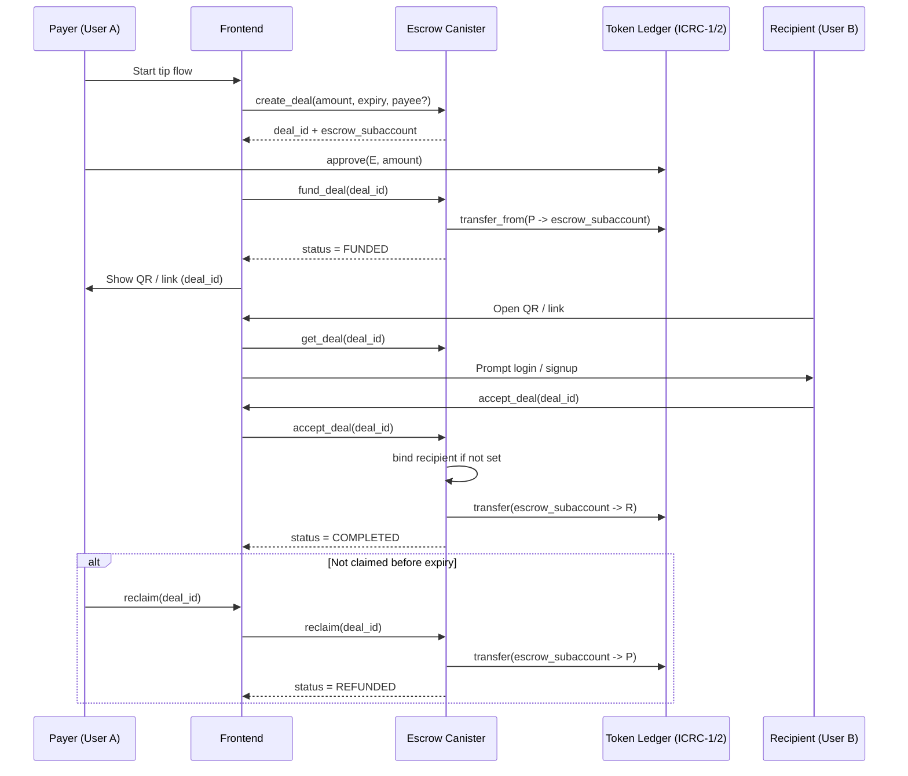
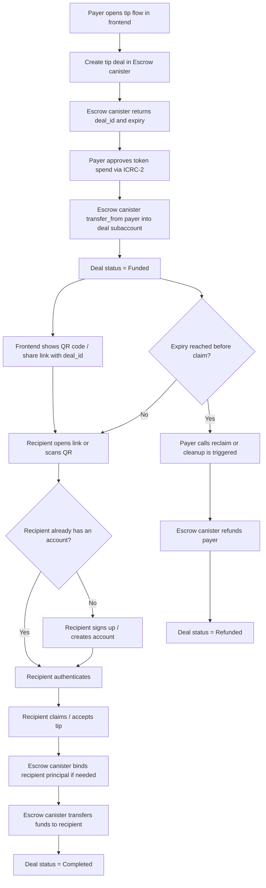

## Tip flow (MVP)

The tip flow is a simple **YES/YES escrow flow**:

- the payer creates and funds a tip deal
- the recipient receives a QR code or link
- if the recipient signs up and accepts before expiry, the funds are released
- if the recipient never claims the tip, the payer gets refunded after the deadline

---

# 🧾 Sequence Diagram (idiomatic)

---

# 🧾 Flowchart (not-idiomatic)

Same thing but with a different chart type.

